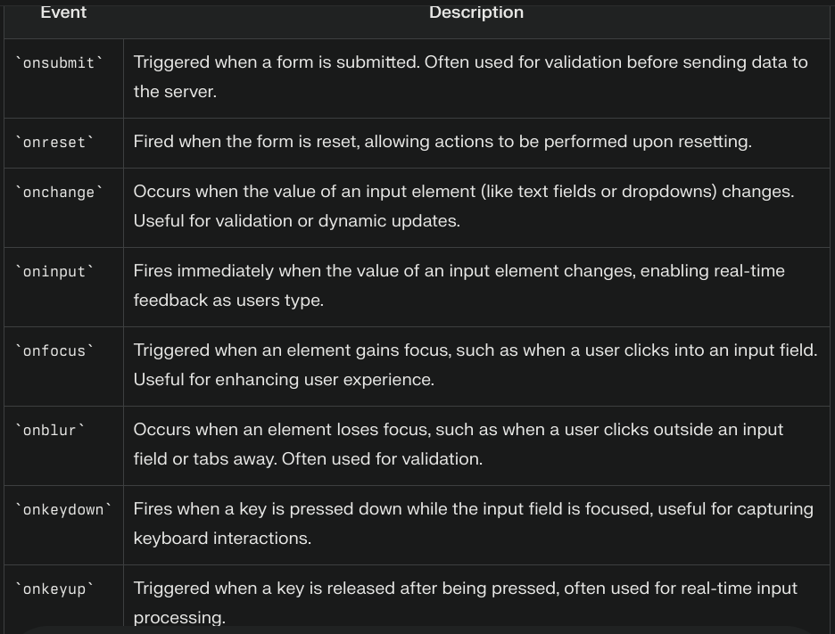

<<<<<<< HEAD
By default when submitting forms the page refreshes thus we need to handle it in some way.
using formData object in JS.

EVENTS ON FORM:
Submit Event: Triggered when the form is submitted.
Change Event: Occurs when the value of an input element changes.
Input Event: Fires whenever the user types into an input field2.
FormData Event: The formdata event occurs after a form's data is constructed upon submission. This event allows developers to modify the data before it is sent to the server.

=======
By default when submitting forms the page refreshes thus we need to handle it in some way.
using formData object in JS.

EVENTS ON FORM:

Submit Event: Triggered when the form is submitted.

Change Event: Occurs when the value of an input element changes.

Input Event: Fires whenever the user types into an input field2.

FormData Event: The formdata event occurs after a form's data is constructed upon submission. This event allows developers to modify the data before it is sent to the server.

>>>>>>> baf1c29a3aacd8498d6d00fb7478fd8b58fff9fe
